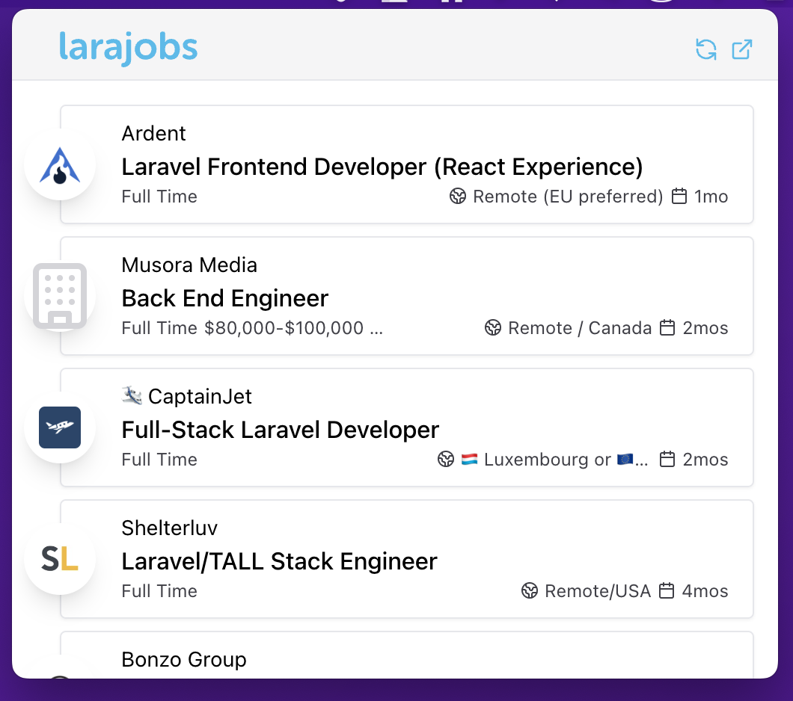

# LaraJobs Desktop

I hope this can be a useful codebase for those looking to learn how to work [NativePHP](https://nativephp.com/).

## Features

-   Uses SQLite to store data fetched from RSS feed
-   Setup to potentially soft delete (dismiss jobs)
-   Prunes jobs that are older than one month, or soft deleted, runs daily
-   Refreshes the feed every minute
-   Made to look and feel like LaraJobs
-   Refresh button
-   Link to LaraJobs website
-   Almost all job posting data is displayed except for tags, but everything in the feed as of this commit should be stored in the database.

## POI

These are the files where most of the implementation logic is placed.

-   `config/larajobs.php`
-   `config/nativephp.php`
-   `database/migrations/2023_07_23_001629_create_jobs_table.php`
-   `resources/views/menu-bar-home.blade.php`
-   `app/Providers/NativeAppServiceProvider.php`
-   `app/Providers/LaraJobsProvider.php`
-   `app/Services/FeedService.php`
-   `app/Listeners/HandleRefreshFeedLink.php`
-   `app/Models/Jobs.php`
-   `app/Console/Commands/LaraJobsRefreshFeed.php`
-   `app/Console/Kernel.php`
-   `bootstrap/helpers.php`

## Developing

-   Run `pnpm dev (or use yarn or npm)`
-   Run `php artisan native:serve`

### Useful Commands

-   `php artisan native:serve` - starts the server
-   `tail -f storage/logs/laravel.log` - logs are written here, keep it open just in case
-   `softwareupdate --install-rosetta` - installs Rosetta 2, which circumvents a minor problem in NativePHP where the Intel binary is always copied and used
-   ` php artisan larajobs:refresh-feed` - refresh the database using the RSS feed, this will fetch and add new jobs if the feed has any
-   `seq 100 | xargs -I {} sh -c 'echo "Running command {}"; php artisan larajobs:refresh-feed'` - little trick to populate the database

### Database

On Mac, you can find the SQLite database at `~/Library/Application Support/NativePHP/database/database.sqlite`. This would probably change once the application information such as the name is changed from `NativePHP`.

## Configure

### Environment

Copy `.env.example` to `.env` and set `LARAJOBS_FEED_URL=https://larajobs.com/feed` or use the test feed at `https://larajobs.com/feed-test` if needed.

### Config

Please review `config/larajobs.php` for other configurable values.

## Missing

-   As of this commit I've tested building the application and it did not work. Will give it a try after some more discovery.
